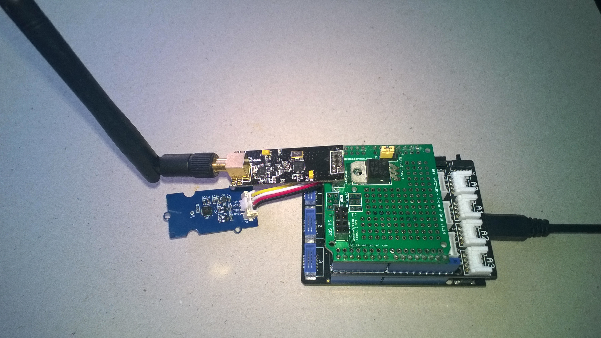

Sample plug n play Netduino 2, Netduino Plus 2, Netdiono 3, Netduino 3E & Netduino 3 Wifi clients for my nRF24L01 field gateway projects

My Netduino clients use
* [RFX Arduino shield](http://embeddedcoolness.com/shop/rfx-shield/)
* [SeeedStudio Grove-Temperature & Humidity Sensor ](https://www.seeedstudio.com/Grove-Temperature%26Humidity-Sensor-%28High-Accuracy-%26-Mini%29-p-1921.html)
* [SeeedStudio Grove-Universal 4 Pin Buckled 5cm Cable](https://www.seeedstudio.com/Grove-Universal-4-Pin-Buckled-5cm-Cable-%285-PCs-Pack%29-p-925.html)
* [SeeedStudio Grove-Base Shield V2](https://www.seeedstudio.com/Base-Shield-V2-p-1378.html)
* [Netduino V2 or V3 device](https://www.wildernesslabs.co/Netduino)

For clients without a Mac Address (i.e. Netduin 2 or Netduino 3) you can modify the code to use a human generated deviceID
